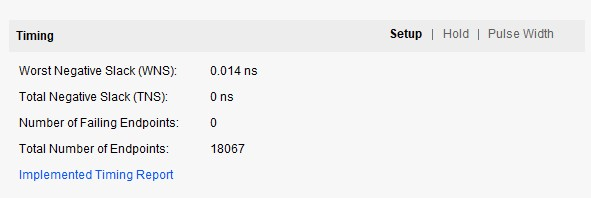
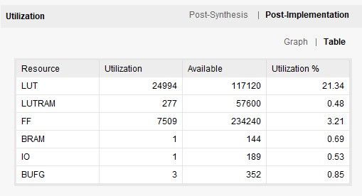
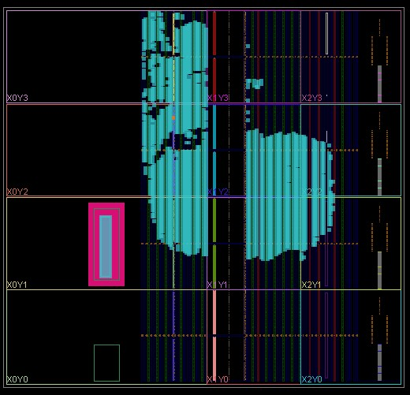
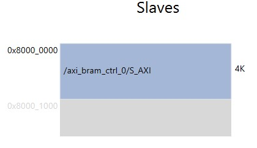

# DPRAM를 이용한 string matching

## 1. DPRAM
VIVADO 2021.2의 버그로 KV260의 PL_clk0의 클럭을 200Mhz로 바꾸어도 실제 출력 클럭이 100Mhz로 고정됨     
전체 시스템을 동일한 클럭으로 묶는 것 대신 PS-PL axi bus는 100Mhz로 동작, matcher module은 200Mhz로 동작하도록 변경    
다른 클럭 도메인을 넘어가기 위해 true dual port ram을 이용하여 metastability상태 해결    
    
32개의 matcher module을 사용하여 전체 동작에 대한 테스트 진행    

## 2. 합성 결과
   
static timing analysis 결과    
   
KV260의 resource 사용량    
   
logic cell의 배치 및 연결 결과    

## 3. 소프트웨어 Address map
      

## 4. 합성 회로도
[회로도](./image/schematic.pdf)     