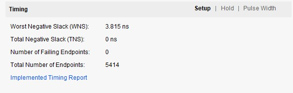
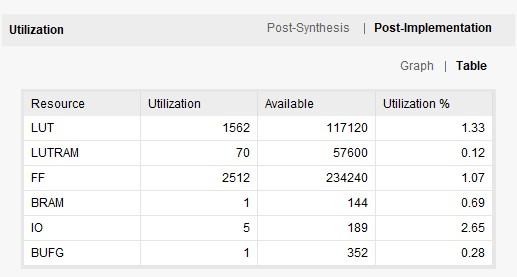
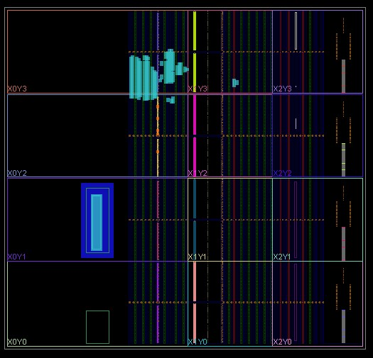
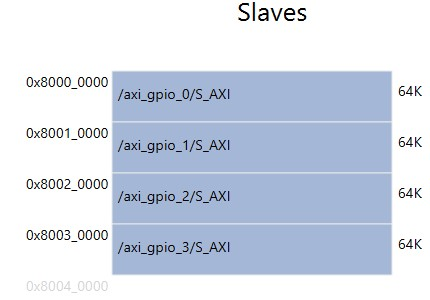

# GPIO를 이용한 string matching

## 1. GPIO
    
각 matcher moule의 결과를 GPIO로 출력하여 오실로스코프를 이용하여 runtime 측정    

    
보드의 PMOD핀을 이용하여 PL 로직에서 출력되는 신호 측정   
    
1개의 matcher module을 사용하여 전체 동작에 대한 테스트 진행

## 2. 합성 결과
   
static timing analysis 결과    
   
KV260의 resource 사용량    
   
logic cell의 배치 및 연결 결과    

## 3. 소프트웨어 Address map
      

## 4. 합성 회로도
[회로도](./image/schematic.pdf)    