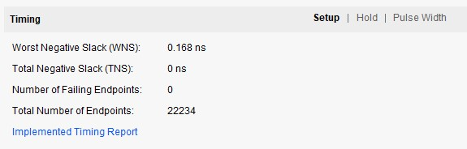
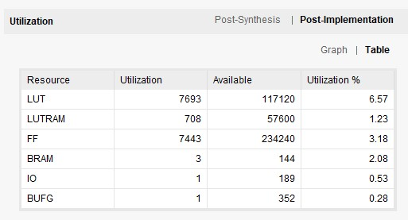
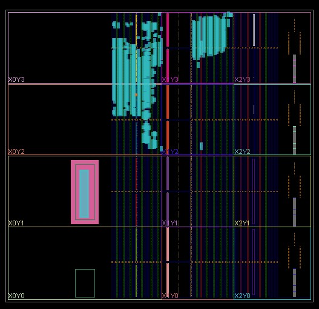
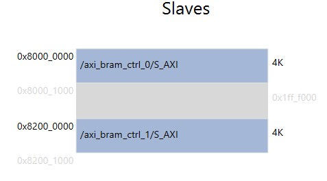

# RISC-V를 이용한 string matching

## 1. RISC-V
## [RISC-V instruction set spec sheet](../../../003%20DOC/external_doc/riscv-spec-20191213.pdf)    
risc-v를 구현하기 위해 instruction 구조의 분석 필요       
   

디버깅 -> instruction의 imm구조 파악    
    

instruction별 operation code 분석 필요     
      

## 2. 합성 결과
   
static timing analysis 결과    
   
KV260의 resource 사용량    
   
logic cell의 배치 및 연결 결과    

## 3. 소프트웨어 Address map
      

## 4. 합성 회로도
[회로도](./image/schematic.pdf)    