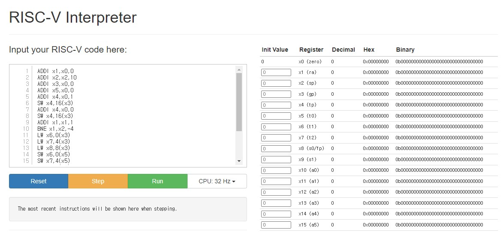
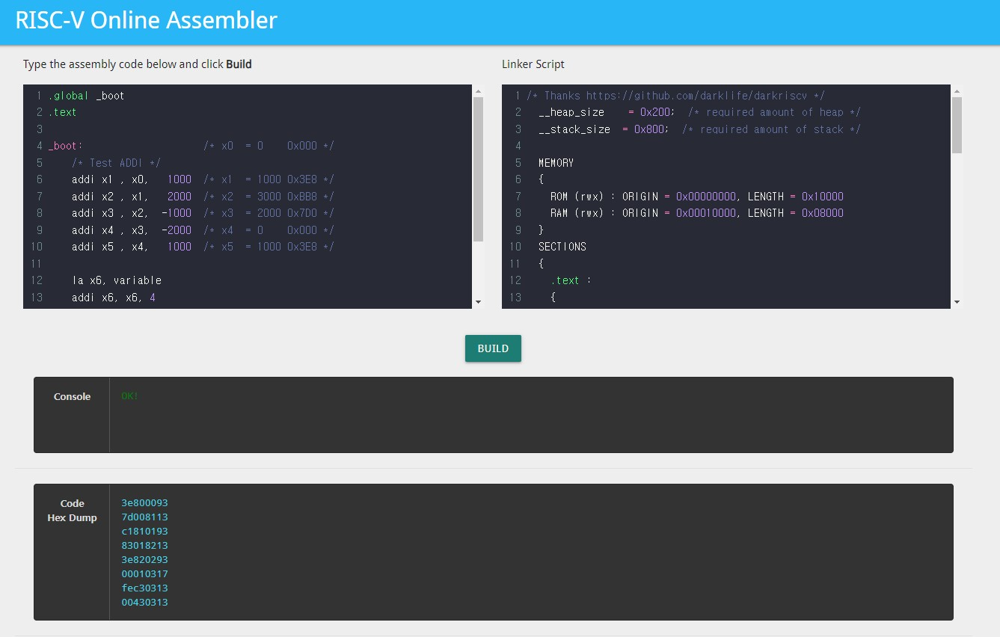

# RISC-V 소프트웨어 개발

## 1. RISC-V assembly
## [RISC-V instruction set spec sheet](../../../../../003%20DOC/external_doc/riscv-spec-20191213.pdf)    
risc-v를 구현하기 위해 instruction 구조의 분석 필요       
   
instruction 구조 분석 후 실제 구조를 명확히 하기 위해 assembly binary 직접 작성    
```
00000713 //ADDI x14, x0, 0
00A00613 //ADDI x12, x0, 1010
00100693 //ADDI x13, 0x, 1
00E68733 //ADD x14, x13, x14
00168693 //ADDI x13, x13, 1
FEC6CCE3 //BLT x13, x12, 1111111111000
FD470F13 //ADDI x30, x14, 111111010100
00005063 //BGE x0, x0, 0
```
손으로 작성 이후 RISC-V instruction hex converter를 이용하여 hex코드로 변환 시도    
[hex converter web](https://www.eg.bucknell.edu/~csci206/riscv-converter/index.html)   

hex 변환 이후 assembly 코드를 이용하여 코어가 완성되기 전에 RISC-V interpreter를 이용하여 실행상황을 확인함     
## [RISC-V interpreter](https://www.cs.cornell.edu/courses/cs3410/2019sp/riscv/interpreter/)    
    

interpreter를 이용하여 동작을 확인하고 assembler를 이용하여 최적화된 instruction hex파일을 뽑아냄    
## [RISC-V assembler](https://riscvasm.lucasteske.dev/#)    
    
     
최종 matching module 테스트를 위한 assembly 코드 작성
```
/*카운터 초기화*/
ADDI x1,x0,0
/*카운터 max set*/
LUI x2,48828
ADDI x2,x2,512
/*load주소 설정*/
ADDI x3,x0,1
SLLI x3,x3,11
/*save주소 설정*/
ADDI x5,x0,0
/*로직 카운터 초기화*/
ADDI x4,x0,1
SW x4,16(x3)
ADDI x4,x0,0
SW x4,16(x3)
/*count 시작*/
ADDI x1,x1,1
BNE x1,x2,-4
/*끝나면 데이터 로드*/
LW x6,0(x3)
LW x7,4(x3)
LW x8,8(x3)
/*레지스터에 저장한 데이터 세이브*/
SW x6,0(x5)
SW x7,4(x5)
SW x8,8(x5)
/*로직 카운터 초기화*/
ADDI x4,x0,1
SW x4,16(x3)
ADDI x4,x0,0
SW x4,16(x3)
/*카운터 초기화*/
ADDI x1,x0,0
JAL x0,-52
```
HEX파일로 변환시 결과    
```
00000093
0bebc137
20010113
00100193
00b19193
00000293
00100213
0041a823
00000213
0041a823
00108093
FE209FE3
0001a303
0041a383
0081a403
0062a023
0072a223
0082a423
00100213
0041a823
00000213
0041a823
00000093
FE7FF06F
FCDFF06F
```